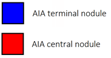

## Where to go
You will find two jupyter notebooks in the folder starting by AIA in which we train a 3D Unet for each neuron. To reproduce the results, please contact us to be granted an access to the data we used.
You will find in the main folder a lot of helpers such as nd2 converted that were used because the format couldn't be read on some machines that we used.

## Results
Here is a result of an 3D image on which we do prediction and which is a gif going through all the slices according to the z direction.

  ___________ input volume _____________________________ ground truth ______________________________ prediction _____________

